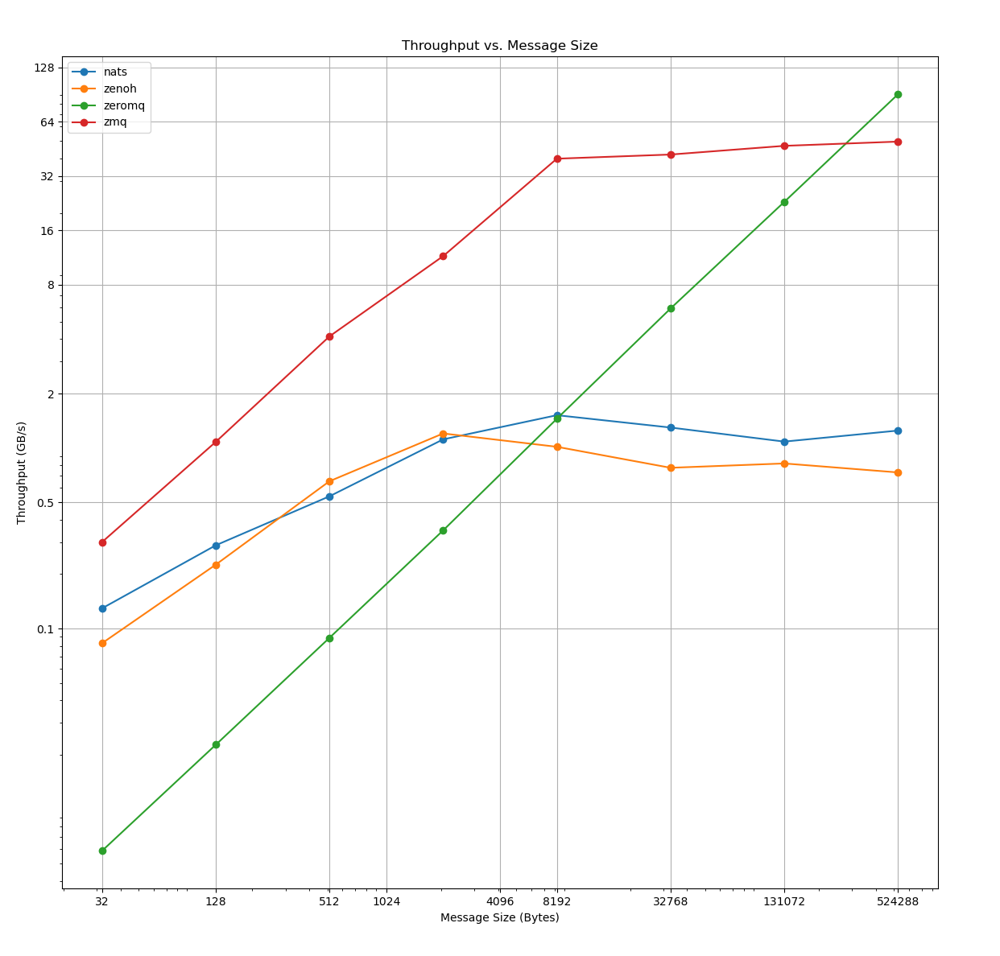

# Benchmarking Comparison Data Transports

## Prerequisites

In order to run the `Pub-Sub/nats` you'll need the `nats-server` binary.

Follow along with the instructions
[here](https://docs.nats.io/running-a-nats-service/introduction/installation#getting-the-binary-from-the-command-line)
on the nats.io website.

You will need to run the `nats-server` in another terminal like so:

```sh
nats-server
```

## Overview

This crate does a benchmark between several data transport implementations
comparing throughput in GB/s.

The following implementations are tested:

* `nats`: Pure async Rust NATs client.
* `zenoh`: Pure async Rust pub/sub network protocol.
* `zeromq`: Pure async Rust implementation of ZMQ.
* `zmq`: Safe sync Rust wrapper around `libzmq`, written in C.

## Running the benchmark

If you run:

```sh
cargo bench
```

The benchmarks will run with several message sizes:

`32`, `128`, `512`, `2048`, `8192`, `32768`, `131072` and `524288`.

The resulting graphs will be located at:

`$CARGO_TARGET_DIR/criterion/report/index.html`

Because criterion's plotting customizations are limited, there is a python
script and `justfile` provided for more comparative results on throughput.

The following requires [just](https://github.com/casey/just) and
[matplotlib](https://matplotlib.org/) installed. There's an accompanying
`shell.nix` which can install these dependencies for you by running `nix-shell`
if you have [nixpkgs](https://nixos.org/) installed.

```sh
just benchmark
```

This will open a graph showing throughput vs message size.

### Flamegraphs

To run the benchmarks and generate a flamegraph:

```sh
cargo bench --profile flamegraph --bench benchmark -- --profile-time 30
```

The resulting flamegraphs will be located at:

`$CARGO_TARGET_DIR/criterion/Pub-Sub/<benchmark>/<message_size>/profile/flamegraph.svg`

## Interpreting the results

The default for `$CARGO_TARGET_DIR` is `./target`.

The output will look something like this:

```sh
$ cargo bench --bench benchmarks -- --nocapture
Pub-Sub/nats/32         time:   [247.36 µs 249.24 µs 251.19 µs]
                        thrpt:  [121.49 MiB/s 122.44 MiB/s 123.37 MiB/s]
Pub-Sub/zenoh/32        time:   [385.79 µs 392.51 µs 398.73 µs]
                        thrpt:  [76.537 MiB/s 77.750 MiB/s 79.104 MiB/s]
Pub-Sub/zeromq/32       time:   [5.4416 ms 5.4557 ms 5.4703 ms]
                        thrpt:  [5.5787 MiB/s 5.5937 MiB/s 5.6082 MiB/s]
Pub-Sub/zmq/32          time:   [106.26 µs 107.03 µs 107.82 µs]
                        thrpt:  [283.04 MiB/s 285.14 MiB/s 287.19 MiB/s]
```

Quoting from the Criterion
[docs](https://bheisler.github.io/criterion.rs/book/user_guide/command_line_output.html#time):

> This shows a confidence interval over the measured per-iteration time for this
benchmark. The left and right values show the lower and upper bounds of the
confidence interval respectively, while the center value shows Criterion.rs'
best estimate of the time taken for each iteration of the benchmarked routine.

The same holds for the throughput.

### Outliers

You may also see lines similar to this:

```sh
Found 13 outliers among 100 measurements (13.00%)
  3 (3.00%) low severe
  3 (3.00%) low mild
  4 (4.00%) high mild
  3 (3.00%) high severe
```

Quoting again from the Criterion [docs](https://bheisler.github.io/criterion.rs/book/user_guide/command_line_output.html#detecting-outliers):

> Criterion.rs attempts to detect unusually high or low samples and reports them
as outliers. A large number of outliers suggests that the benchmark results are
noisy and should be viewed with appropriate skepticism. In this case, you can
see that there are some samples which took much longer than normal. This might
be caused by unpredictable load on the computer running the benchmarks, thread
or process scheduling, or irregularities in the time taken by the code being
benchmarked.

## Example Results

* CPU: Intel(R) Core(TM) i9-14900HX
* RAM: 64GB
* Message Count: 1000


